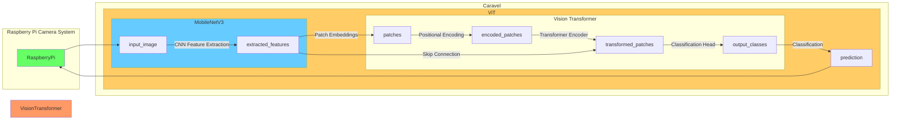

# VT512

A 512 bit Vision Transformer with `MobileNetV3` CNN for feature extraction.

> This is not an official research project with the Oregon State University.

## WARNING

This is a work in progress, I thought having AI would make it possible to complete in a day but it is certainly slowing me down with horrible response. Due to the lack of time, this project does not come with a testbench and have not been verified.

## Setup

To setup environment ***after*** completing Caravel setup, run the following command in the root directory of the project.

```bash
source setup.sh
```

## Introduction

This is a simple lightweight Vision Transformer for image classification. The model uses `MobileNetV3` as the CNN for feature extraction and `ViT` as the Transformer Encoder.

## Architecture



- [x] ImageCapture
- [ ] CNN Feature Extraction
- [ ] Patch Embeddings
- [ ] Positional Encoding
- [ ] Transformer Encoder
- [ ] Classification Head
- [ ] Classification

## Configuration

### Image Capture

The Image Capture module capture 1 pixel at a time and store it to the memory using wishbone interconnect which comes with a 32 bit bus.

Using 100MHz (which is a strech for Caravel), the module can capture 100M pixels per second. The maximum resolution is 512 by 512 which translates to 262144 pixels. This is equivalent to 0.00262144 seconds per frame or 381.469726563 frames per second. Image stream is probably at 60 frames per second max so this is more than enough.

This module support the following configurations:

- [x] 1 Channel Image (Grayscale)
- [x] 3 Channels Image (RGB888 or YUV888)
- [x] 4 Channels Image (RGB + Grayscale or even RGB + Alpha)

To use the module in the specific format, the configuration register must be set to the following value:

| Channel | Register Value |
| ------- | -------------- |
| 1       | 32'hXXXX_XXX1  |
| 3       | 32'hXXXX_XXX3  |
| 4       | 32'hXXXX_XXX4  |

Wishbone Image Data Structure:

| Bit Range      | [31:24]    | [23:16]    | [15:8]     | [7:0]      |
| -------------- | ---------- | ---------- | ---------- | ---------- |
| Channel Used   | Channel 4  | Channel 3  | Channel 2  | Channel 1  |
| Operation Mode | Mode 3 & 4 | Mode 3 & 4 | Mode 3 & 4 | Mode 1 & 4 |
| Example Mode 1 |            |            |            | Grayscale  |
| Example Mode 3 | R          | G          | B          |            |
| Example Mode 4 | R          | G          | B          | A          |

NOTE: The `channel` in this section is the color channel of the image.

### CNN Feature Extraction

#### CNN Architecture Configuration

The CNN Feature Extraction uses a lightweight user configurable CNN model. The CNN model is configured using the configuration register. The configuration register is a 32 bit register with the following format:

| Parameter        | Register Bits | Description               |
| ---------------- | ------------- | ------------------------- |
| Filter           | [7:4]         | See Operation Mode        |
| Conv Layers      | [11:8]        | Number of layers up to 16 |
| Pooling Layers   | [15:12]       | Number of layers up to 16 |
| Pooling Interval | [19:16]       | Pooling Interval          |

#### Operation Modes

This module support the following CNN modes: P mode and V mode. The CNN mode can be selected by setting the configuration register to the following value:

| Mode | Register Value |
| ---- | -------------- |
| P    | 32'hXXXX_XX3X  |
| V    | 32'hXXXX_XX4X  |

##### P Mode

The P mode is the default mode for the CNN. It uses a padded image with 3x3 filter and a stride of 1 to extract features.

| Parameter | Value   |
| --------- | ------- |
| Filter    | 3x3     |
| Stride    | 1       |
| Padding   | 1       |
| Image     | 510x510 |
| Output    | 510x510 |

##### V Mode

The V mode is an optional mode for the CNN. It uses a padded image with 4x4 filter and a stride of 1 to extract features.

| Parameter | Value   |
| --------- | ------- |
| Filter    | 4x4     |
| Stride    | 1       |
| Padding   | 0       |
| Image     | 512x512 |
| Output    | 509x509 |

## References

This project is created with the help of ChatGPT May 24 Version as required by the the AI Generated Open-Source Silicon Design Challenge. The prompts used to create this project is available at https://chat.openai.com/share/97b14e4b-678d-4793-92a2-292723c7b540 Minor modifications are made by human to optimize and correct the design. This design uses the following references:

- [Vision Transformer](https://arxiv.org/abs/2010.11929)
- [MobileNetV3](https://arxiv.org/abs/1905.02244)
- [MobileViT](https://arxiv.org/abs/2110.02178)
- [MobileViT2](https://arxiv.org/abs/2206.02680)
- [Mobile-Former](https://arxiv.org/abs/2108.05895)

## License

Copyright 2023 Anthony Kung <kungc@oregonstate.edu>

Licensed under the Apache License, Version 2.0 (the "License");
you may not use this file except in compliance with the License.
You may obtain a copy of the License at

    http://www.apache.org/licenses/LICENSE-2.0

Unless required by applicable law or agreed to in writing, software
distributed under the License is distributed on an "AS IS" BASIS,
WITHOUT WARRANTIES OR CONDITIONS OF ANY KIND, either express or implied.
See the License for the specific language governing permissions and
limitations under the License.

## Acknowledgement

The project is created as a external image classification module to complement a Raspberry Pi camera system as a fall detection system to identify and alert when my grandma falls. This project is also inspired by my research project on light weight transformers at Oregon State University System Technology and Application Research Lab under the supervision of Dr. Lizhong Chen, and also related to my class project on Vision Transformer for AI535 Deep Learning taught by Dr. Stephen Lee.