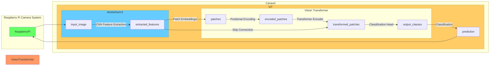

# VT512

A 512 bit Vision Transformer with `MobileNetV3` CNN for feature extraction.

> This is not an official research project with the Oregon State University.

## Setup

To setup environment ***after*** completing Caravel setup, run the following command in the root directory of the project.

```bash
source setup.sh
```

## Introduction

This is a simple lightweight Vision Transformer for image classification. The model uses `MobileNetV3` as the CNN for feature extraction and `ViT` as the Transformer Encoder.

## Architecture



- [x] ImageCapture
- [ ] CNN Feature Extraction
- [ ] Patch Embeddings
- [ ] Positional Encoding
- [ ] Transformer Encoder
- [ ] Classification Head
- [ ] Classification

## References

This project is created with the help of ChatGPT May 24 Version as required by the the AI Generated Open-Source Silicon Design Challenge. The prompts used to create this project is available at `PROMPT.md` Minor modifications are made by human to optimize and correct the design. This design uses the following references:

- [Vision Transformer](https://arxiv.org/abs/2010.11929)
- [MobileNetV3](https://arxiv.org/abs/1905.02244)
- [MobileViT](https://arxiv.org/abs/2110.02178)

## License

Copyright 2023 Anthony Kung <kungc@oregonstate.edu>

Licensed under the Apache License, Version 2.0 (the "License");
you may not use this file except in compliance with the License.
You may obtain a copy of the License at

    http://www.apache.org/licenses/LICENSE-2.0

Unless required by applicable law or agreed to in writing, software
distributed under the License is distributed on an "AS IS" BASIS,
WITHOUT WARRANTIES OR CONDITIONS OF ANY KIND, either express or implied.
See the License for the specific language governing permissions and
limitations under the License.

## Acknowledgement

The project is created as a external image classification module to complement a Raspberry Pi camera system as a fall detection system to identify and alert when my grandma falls. This project is also inspired by my research project on light weight transformers at Oregon State University System Technology and Application Research Lab under the supervision of Dr. Lizhong Chen, and also related to my class project on Vision Transformer for AI535 Deep Learning taught by Dr. Stephen Lee.