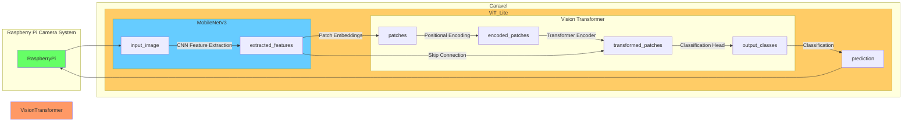

```mermaid
graph LR
    subgraph Raspberry Pi Camera System
        RaspberryPi
    end

    subgraph Caravel
        subgraph ViT_Lite
            subgraph MobileNetV3
                input_image --> |CNN Feature Extraction| extracted_features
            end

            subgraph Vision Transformer
                extracted_features --> |Patch Embeddings| patches
                patches --> |Positional Encoding| encoded_patches
                encoded_patches --> |Transformer Encoder| transformed_patches
                transformed_patches --> |Classification Head| output_classes
            end

            extracted_features --> |Skip Connection| transformed_patches
            output_classes --> |Classification| prediction
        end
    end

    RaspberryPi --> input_image
    prediction --> RaspberryPi

    style RaspberryPi fill:#66ff66
    style MobileNetV3 fill:#66ccff
    style VisionTransformer fill:#ff9966
    style ViT_Lite fill:#ffcc66
```